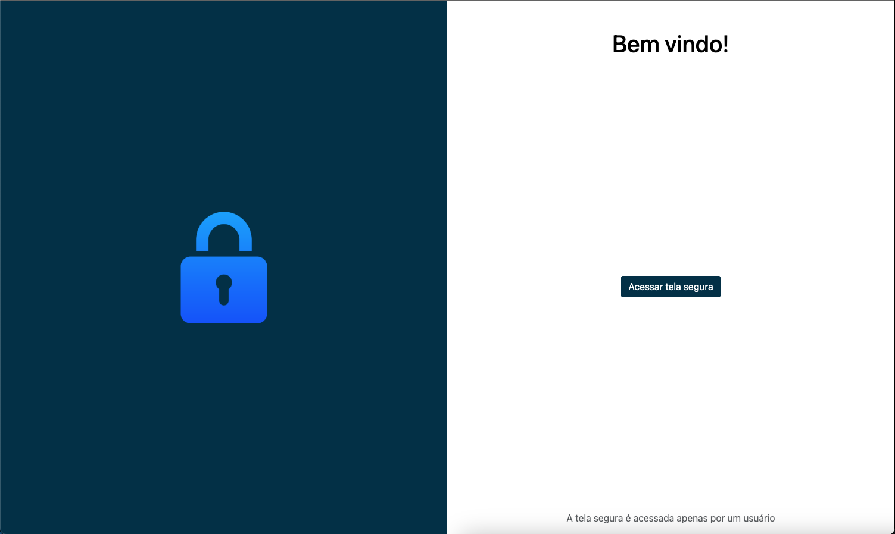
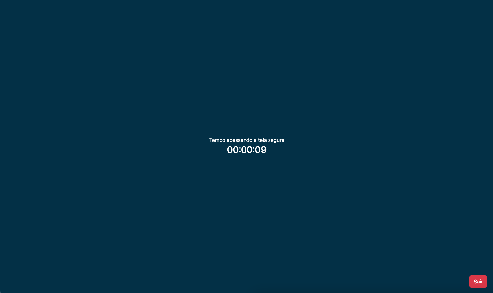

# Tela Segura

## Sobre o Projeto

Breve descrição do projeto, incluindo a finalidade e as tecnologias utilizadas.

Este projeto é uma aplicação React que funciona em navegadores web, acompanhada de um backend Node.js. 
O objetivo é desenvolver uma aplicação com uma funcionalidade única: apenas uma pessoa por vez pode acessar uma "tela segura". 
Esta restrição é controlada através de um sistema backend.

## Funcionalidades

- **Tela Segura**: Acesso exclusivo a uma tela específica por apenas um usuário por vez.
- **Controle de Acesso**: Backend Node.js para gerenciar o acesso à tela segura.

## Tecnologias Utilizadas

- Frontend: React
- Backend: Node.js
- Gerenciamento de Containers: Docker
- Banco de dados: PostgreSQL

## Começando

Para executar este projeto localmente, de forma simples, você precisará de Docker e Docker Compose instalados em sua máquina.

### Pré-requisitos

- Docker
- Docker Compose

### Instalação e Execução

1. Clone o repositório
2. Navegue até a pasta do projeto e execute o Docker Compose:
    docker-compose up

Este comando irá construir e iniciar os containers necessários para o frontend e o backend. Após a conclusão, a aplicação estará acessível via navegador web.

## Fotos do Projeto

Aqui, você pode adicionar fotos da sua aplicação para fornecer uma visualização do projeto em funcionamento.

- **Tela Principal**: 
- **Tela Segura**: 

## Documentação Adicional

Para mais informações sobre as partes específicas do projeto, consulte as documentações individuais:

- [Frontend](./frontend/README.md)
- [Backend](./backend/README.md)